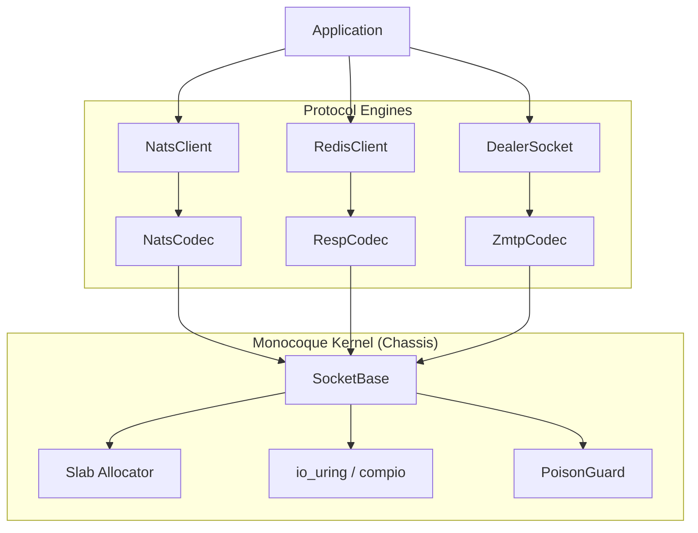

# Blueprint 09: Multi-Protocol Kernel Architecture (The "Omni-Kernel" Strategy)

**Status:** Proposed **Target Phase:** Phase 8 (Expansion) **Objective:** Leverage the `io_uring` + `SlabMut` architecture to support lightweight protocols (NATS, MQTT, Redis/RESP) with zero-copy semantics.

---

## 1. Architectural Vision: The "Chassis & Engine" Model

Currently, `SocketBase` is lightly coupled to ZMTP concepts. To support multi-protocol, we must refactor the architecture into three strict layers:

1. **The Chassis (`monocoque-core`):** Handles `io_uring`, `SlabMut` allocation, `PoisonGuard`, Backpressure, and Connection Resilience. This is protocol-agnostic.
2. **The Engine (`monocoque-proto`):** A trait-based framing layer that dictates how raw bytes turn into logical units (Frames).
3. **The Body (`monocoque-<protocol>`):** The public API (e.g., `NatsClient`, `RedisConnection`) that provides the developer UX.



---

## 2. The Abstraction: `MonocoqueCodec`

We need a unified trait that allows the `SocketBase` to perform framing without understanding the payload.

```rust
// monocoque-core/src/traits.rs

pub trait MonocoqueCodec {
    /// The logical unit of the protocol (e.g., ZmtpMessage, NatsCommand, RedisValue)
    type Item;

    /// The error type specific to protocol parsing
    type Error: std::error::Error;

    /// ATTEMPT to decode a frame from the buffer.
    /// Returns:
    /// - Ok(Some(Item)): A full frame was parsed.
    /// - Ok(None): Not enough bytes yet (continue reading).
    /// - Err(e): Fatal protocol error (triggers PoisonGuard).
    fn decode(&mut self, src: &mut SegmentedBuffer) -> Result<Option<Self::Item>, Self::Error>;

    /// Encodes an item into the write buffer.
    /// Crucially, this supports the Batching API naturally.
    fn encode(&mut self, item: Self::Item, dst: &mut IoArena) -> Result<(), Self::Error>;
}

```

---

## 3. Protocol Implementation Strategies

### Strategy A: NATS (The "Zero-Allocation" Champion)

**Profile:** Text-based, extremely fast, stateless. **Advantage:** We can parse NATS commands using **views** (slices) into the `SlabMut`, avoiding `String` allocations entirely.

-   **Implementation:**
-   `NatsCodec` scans for `\r\n`.
-   Instead of returning `String`, it returns `NatsCommand<'a>` holding `Bytes` references.
-   Payloads use the existing `Bytes` ref-counting mechanism.

-   **Performance Target:** Outperform the official Go server (`gnatsd`) in parsing speed by eliminating GC pauses.

### Strategy B: Redis / RESP3 (The "Pipeline" Champion)

**Profile:** Request/Response, heavily pipelined. **Advantage:** `io_uring` batching is a perfect match for Redis pipelining.

-   **Implementation:**
-   The `send_buffered()` API becomes the default way to send Redis commands.
-   `client.set("key", "value")` -> writes to buffer.
-   `client.get("key")` -> writes to buffer.
-   `client.flush().await` -> Sends all in ONE syscall.
-   The `RespCodec` parses the stream of replies and correlates them.

-   **Performance Target:** Saturate 100GbE links with a single core (similar to DragonflyDB architecture).

### Strategy C: MQTT 5.0 (The "C10M" Champion)

**Profile:** Many idle connections, small binary packets, stateful (QoS). **Advantage:** Memory efficiency of `SlabMut`.

-   **Implementation:**
-   Focus on the **Broker** side (Server).
-   Each connection consumes only the size of the `SocketBase` struct (~200 bytes) + empty Slab pages.
-   We can hold 1 million idle connections with minimal RAM footprint compared to Java/Go implementations.

-   **Performance Target:** Massive concurrency with stable latency (no "stop-the-world" GC).

---

## 4. Shared Kernel Advantages (Inherited Traits)

By building on Monocoque, every new protocol gets these "for free":

1. **PoisonGuard Architecture:**

-   _Scenario:_ A Redis `get` times out half-way through receiving a 1GB value.
-   _Result:_ The connection is automatically marked poisoned and reconnected. No partial state corruption.

2. **Backpressure (HWM):**

-   _Scenario:_ A slow NATS subscriber.
-   _Result:_ The `BytePermits` system prevents the publisher from allocating infinite memory, pushing backpressure up the stack naturally.

3. **Syscall Amortization:**

-   Every protocol gets the `send_buffered()` + `flush()` capability, enabling throughputs impossible with standard `TcpStream` writes.

---

## 5. Implementation Roadmap

1. **Refactor Core:** Extract `ZmtpDecoder` logic out of `SocketBase` and replace with `T: MonocoqueCodec`.
2. **Pilot Protocol (Redis):** Implement a minimal `RespCodec`. It is simpler than ZMTP and proves the abstraction works for Request/Response.
3. **Performance Benchmark:** Compare `monocoque-redis` vs `redis-rs` (Tokio based).

-   _Hypothesis:_ 40-50% throughput gain on pipelined workloads.

4. **Expansion:** Implement NATS (Pub/Sub focus) and MQTT (IoT focus).

---

### Conclusion

This blueprint transforms Monocoque from a "ZMQ Library" into a **"High-Performance I/O Runtime"**. It validates the thesis that the _Architecture_ (Thread-per-core + io_uring + Slab) is the product, and the protocols are just adapters.
